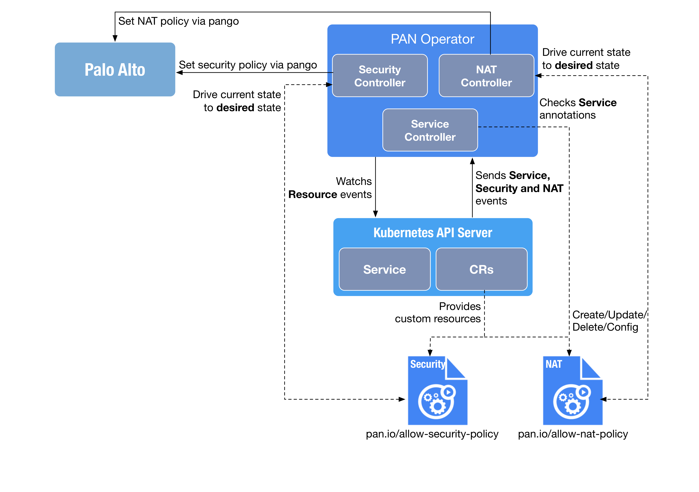

# PAN Operator

## Background 
由於目前 PA 並沒有跟 Kubernetes 進行整合，因此需要開發一個 Operator 來整合 PA 的 NAT 與安全性策略，一旦 Kubernetes Service 被設定成 LoadBalancer 型態，且分配了一個 ExternalIP 時，該 Operator 可以依據 Service 的 Annotations 的內容來自動建立 NAT 與 Security(Kubernetes Custom Resource)資源，一旦 NAT 與 Security 資源被建立時，Operator 會開始與 PA 透過 API 來進行溝通，使目前資源狀態符合預期結果來完成 PA 上的 NAT 與安全性策略功能設定。

## Architecture
PAN Operator 會實現三個 Controller 來監聽 Kubernetes 資源，並與 PA 溝通以同步 Kubernetes 資源中所預期的狀態。

